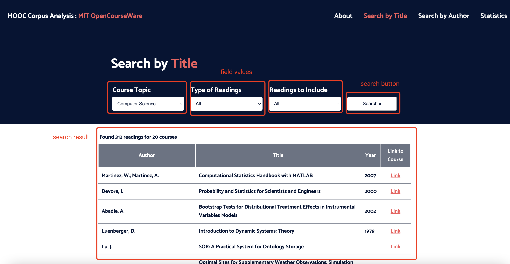
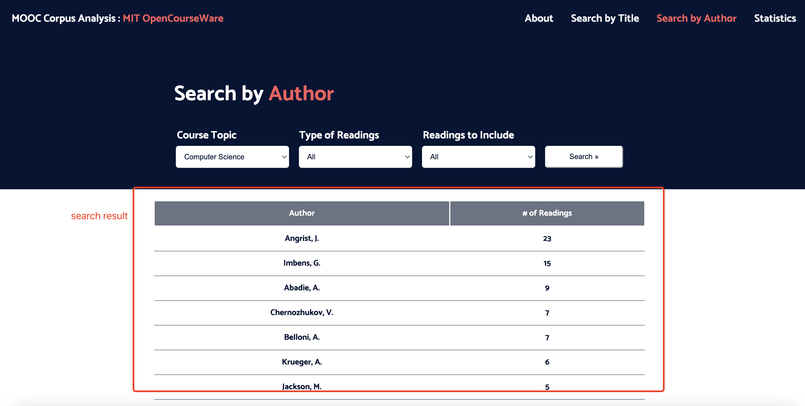

# front_end_readme.md

## Package Requirement
- Python (>=3.7)
- pandas
- json
- fastapi

## Getting Started
### Repo Structure
```
.
├── data
│   ├── author_database.tsv
│   ├── index_to_link.json   
│   ├── reading_database.tsv    
│   └── topic_dropdown.txt
├── static├
│   ├── css
│   │   ├── about.css
│   │   ├── search.css
│   │   └── stats.css
│   ├── img
│   │   └── ... some png for html
│   └── front_end.js
├── templates
│   ├── _notes  
│   │   └── search-by-title.html.mno
│   ├── search-by-author.html   
│   └── search-by-title.html    
├── front_end_readme.md
├── index.html
├── main.py
└── statistics.html
```

### Usage
```
1. python main.py
2. clik on the link in the output log
```
## Front end description
CSS is used to control the styling and layout of the page, while JavaScript is used to add interactivity.

### About page
This is the home page of our website, which contains the project introduction.
- html file: index.html
- CSS file: about.css
- Navigation Bar contains four clicks: **_About_**, **_Search by Title_**, **_Search by Author_**, and **_Statistics_**.
They are href links which redirect to the corresponding page.
  - <br />
- Two buttons: **_Search by Title_**, **_Search by Author_**. They have similar functions with the ones in Navigation Bar, which will direct users to Search by Title and Search by Author pages. 


### Search by Title page
The search page of our website, which is one of the main functionalities. 
It could search important readings related to their topic of interest, format(book, academic paper, or both), 
and necessity (required, optional, or both).
- html file: search-by-title.html
- CSS file: search.css
- Search container 
  - Three selections: **_Course Topic_**, **_Type of Readings_**, and **_Readings to Include_**.
    - options value for **_Course Topic_**
      - Use the template return by _Request_ to render the search-by-title.html, and passing two key-value pairs - 
      request and topic_options
      ```
      templates.TemplateResponse(
        'search-by-title.html',
        context={
            'request': request,
            'topic_options': topic_dropdown, 
            })
      ```
      - use JQuery in search-by-title.html to fill in topic selection options 
      ```
      <select name="topicselection">
              
                  <option value="{{ topic }}">{{ topic }}</option>
              
            </select>
      ```
    - **_Type of Readings_** and **_Readings to Include_** are fixed in the html
      e.g. for Type of Readings
      ```
      <select name="formatselection">
          <option value="All">All</option>
          <option value="Book">Book</option>
          <option value="Academic Paper">Academic Paper</option>
      </select>
      ```
  - button: **_Search_**
    - when click, button onclick method **search_by_title()** interacts with back end, and it should return a table of reading below
    related to **_Course Topic_**, **_type of reading_**, and **_Readings to Include_** field values.
      - **search_by_title()** in front_end.js
        - get options field values from front end
          ```
          var form = document.getElementById("form");
          const formData = new FormData(form);
          const searchParams = new URLSearchParams(formData);```
          ```
        - use GET method to request information from a back end.
          (e.g. field value: topicselection=Computer Science & formatselection=All & includeselection=All)
          ```
          Request URL: http://xx.x.x.x:xx/search-by-title?topicselection=Computer+Science%0A&formatselection=All&includeselection=All
          Request Method: GET
          Status Code: 200 OK
          ```
        - fill in result with the HTMLResponse using update_page() in front_end.js
          
  - <br />

### Search by Author page
The search page of our website, which is one of the main functionalities. 
It could search important readings related to their topic of interest, format (book, academic paper, or both), 
and necessity (required, optional, or both).
- html file: search-by-author.html
- CSS file: search.css
- Search container 
  - Three selections: **_Course Topic_**, **_Type of Readings_**, and **_Readings to Include_**.
    - options value for **_Course Topic_**
      - Use the template return by _Request_ to render the search-by-title.html, and passing two key-value pairs - 
      request and topic_options
      ```
      templates.TemplateResponse(
        'search-by-author.html',
        context={
            'request': request,
            'topic_options': topic_dropdown, 
            })
      ```
      - use JQuery in search-by-title.html to fill in topic selection options 
      ```
      <select name="topicselection">
              
                  <option value="{{ topic }}">{{ topic }}</option>
              
            </select>
      ```
    - **_Type of Readings_** and **_Readings to Include_** are fixed in the html
      e.g. for Type of Readings
      ```
      <select name="formatselection">
          <option value="All">All</option>
          <option value="Book">Book</option>
          <option value="Academic Paper">Academic Paper</option>
      </select>
      ```
  - button: **_Search_**
    - when click, button onclick method **search_by_author()** interacts with back end, and it should return a table of reading below
    related to **_Course Topic_**, **_type of reading_**, and **_Readings to Include_** field values.
      - **search_by_author()** in front_end.js
        - get options field values from front end
          ```
          var form = document.getElementById("form");
          const formData = new FormData(form);
          const searchParams = new URLSearchParams(formData);```
          ```
        - use GET method to request information from a back end.
          (e.g. field value: topicselection=Computer Science & formatselection=All & includeselection=All)
          ```
          Request URL: http://xx.x.x.x:xx/search-by-author?topicselection=Computer+Science%0A&formatselection=All&includeselection=All
          Request Method: GET
          Status Code: 200 OK
          ```
        - fill in result with the HTMLResponse using update_page() in front_end.js
          
  - <br />


